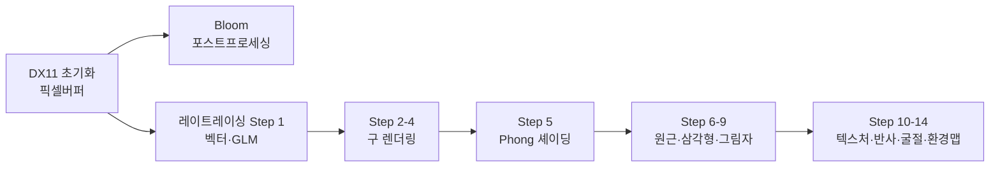

# 컴퓨터 그래픽스 학습 포트폴리오

C++과 DirectX 11로 컴퓨터 그래픽스를 공부하며 직접 구현한 내용을 정리한 포트폴리오입니다.  
강의 코드를 그대로 옮긴 것이 아니라, 학습한 수학·알고리즘을 **JavaScript로 재구현**하여 브라우저에서 직접 체험할 수 있도록 했습니다.

---

## 학습 스택

| 분류 | 기술 |
|------|------|
| 렌더링 API | DirectX 11 (D3D11), HLSL |
| 언어 | C++17 |
| 수학 | GLM (vec3, mat4) |
| UI | Dear ImGui |
| 포트폴리오 | JavaScript Canvas, MkDocs Material |

---

## 학습 로드맵

---

## 인터랙티브 데모

각 주제의 핵심 알고리즘을 브라우저에서 직접 실행해볼 수 있습니다.

<strong>🎨 픽셀 버퍼 애니메이션</strong> 
<small style="color:#94a3b8">CPU 픽셀 쓰기 · 모듈로 색상 파동</small>  
<a href="demos/pixel-animation/">데모 보기 →</a>

<strong>🔮 CPU 레이트레이서</strong> 
<small style="color:#94a3b8">레이-구 교차 · Phong · 그림자</small>  
<a href="demos/raytracer/">데모 보기 →</a>

---

## 최근 학습 포스트

포스트는 학습 저장소에 커밋할 때마다 자동으로 생성됩니다.
