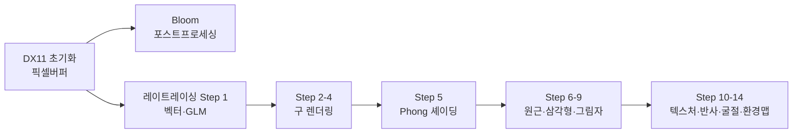

# 컴퓨터 그래픽스 학습 포트폴리오

C++과 DirectX 11로 컴퓨터 그래픽스를 공부하며 직접 구현한 내용을 정리한 포트폴리오입니다.
강의 코드를 그대로 옮긴 것이 아니라, 학습한 수학·알고리즘을 **WebGPU Compute Shader로 재현**하여 브라우저에서 직접 체험할 수 있도록 했습니다.

---

## 학습 스택

| 분류 | 기술 |
|------|------|
| 렌더링 API | DirectX 11 (D3D11), HLSL |
| 언어 | C++17 |
| 수학 | GLM (vec3, mat4) |
| UI | Dear ImGui |
| 포트폴리오 | WebGPU / WGSL, MkDocs Material |

---

## 학습 로드맵

---

## 인터랙티브 데모

각 주제의 핵심 알고리즘을 WebGPU Compute Shader로 재현한 인터랙티브 데모입니다.

<strong>Box Blur 5x5: 수평 패스 구현 및 분리형 컨볼루션 이해</strong>  
<a href="demos/box-blur-5x5-수평-패스-구현-및-분리형-컨볼루션-이해/">데모 보기 →</a>

<strong>boxblur5 분리 가능한 컨볼루션수평 패스 구현 리뷰</strong>  
<a href="demos/boxblur5-분리-가능한-컨볼루션수평-패스-구현-리뷰/">데모 보기 →</a>

<strong>픽셀 버퍼 애니메이션</strong>  
<a href="demos/pixel-animation/">데모 보기 →</a>

<strong>CPU 레이트레이서 — Phong 셰이딩 + 그림자</strong>  
<a href="demos/raytracer/">데모 보기 →</a>

<strong>이미지 밝기 조절 로직 추가 픽셀 단위 연산의 시작</strong>  
<a href="demos/이미지-밝기-조절-로직-추가-픽셀-단위-연산의-시작/">데모 보기 →</a>

<strong>이미지 밝기 조절 픽셀 값 직접 조작하기</strong>  
<a href="demos/이미지-밝기-조절-픽셀-값-직접-조작하기/">데모 보기 →</a>

<strong>학습자의 directx 11 c 그래픽스 스터디 커밋 분석 입력 이미지</strong>  
<a href="demos/학습자의-directx-11-c-그래픽스-스터디-커밋-분석-입력-이미지-/">데모 보기 →</a>

[전체 데모 목록 →](demos/index.md)

---

## 최근 학습 포스트

- [Box Blur 5x5: 수평 패스 구현 및 분리형 컨볼루션 이해](posts/2026-06-13-box-blur-5x5-수평-패스-구현-및-분리형-컨볼루션-이해.md) <small style='color:#64748b'>(2026-06-13)</small>
- [이미지 밝기 조절 로직 추가: 픽셀 단위 연산의 시작](posts/2026-06-11-이미지-밝기-조절-로직-추가-픽셀-단위-연산의-시작.md) <small style='color:#64748b'>(2026-06-11)</small>
- [BoxBlur5 분리 가능한 컨볼루션(수평 패스) 구현 리뷰](posts/2026-06-11-boxblur5-분리-가능한-컨볼루션수평-패스-구현-리뷰.md) <small style='color:#64748b'>(2026-06-11)</small>
- [학습자의 DirectX 11 / C++ 그래픽스 스터디 커밋 분석: 입력 이미지 및 렌더 타겟 클리어 색상 변경](posts/2026-06-10-학습자의-directx-11-c-그래픽스-스터디-커밋-분석-입력-이미지-및-렌더-타겟-클리어-색상-변경.md) <small style='color:#64748b'>(2026-06-10)</small>
- [이미지 밝기 조절: 픽셀 값 직접 조작하기](posts/2026-06-10-이미지-밝기-조절-픽셀-값-직접-조작하기.md) <small style='color:#64748b'>(2026-06-10)</small>

[모든 포스트 보기 →](posts/index.md)
