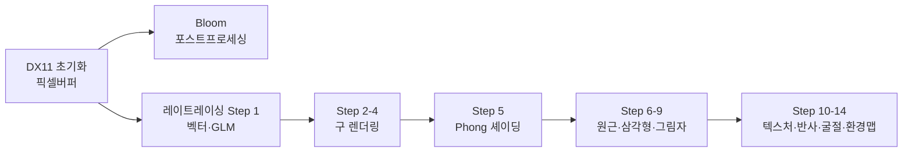

# 컴퓨터 그래픽스 학습 포트폴리오

C++과 DirectX 11로 컴퓨터 그래픽스를 공부하며 직접 구현한 내용을 정리한 포트폴리오입니다.
강의 코드를 그대로 옮긴 것이 아니라, 학습한 수학·알고리즘을 **WebGPU Compute Shader로 재현**하여 브라우저에서 직접 체험할 수 있도록 했습니다.

---

## 학습 스택

| 분류 | 기술 |
|------|------|
| 렌더링 API | DirectX 11 (D3D11), HLSL |
| 언어 | C++17 |
| 수학 | GLM (vec3, mat4) |
| UI | Dear ImGui |
| 포트폴리오 | WebGPU / WGSL, MkDocs Material |

---

## 학습 로드맵

---

## 인터랙티브 데모

각 주제의 핵심 알고리즘을 WebGPU Compute Shader로 재현한 인터랙티브 데모입니다.

<strong>1차원 배열을 통한 2D 캔버스 제어와 CPU-GPU 메모리 매핑</strong>  
<a href="demos/1차원-배열을-통한-2d-캔버스-제어와-cpu-gpu-메모리-매핑/">데모 보기 →</a>

<strong>1차원 배열을 통한 2D 캔버스 제어와 프레임 기반 픽셀 애니메이션</strong>  
<a href="demos/1차원-배열을-통한-2d-캔버스-제어와-프레임-기반-픽셀-애니메이션/">데모 보기 →</a>

<strong>1차원 버퍼와 프레임 업데이트를 통한 픽셀 애니메이션 구현</strong>  
<a href="demos/1차원-버퍼와-프레임-업데이트를-통한-픽셀-애니메이션-구현/">데모 보기 →</a>

<strong>Box Blur 5x5: 수평 패스 구현 및 분리형 컨볼루션 이해</strong>  
<a href="demos/box-blur-5x5-수평-패스-구현-및-분리형-컨볼루션-이해/">데모 보기 →</a>

<strong>boxblur5 분리 가능한 컨볼루션수평 패스 구현 리뷰</strong>  
<a href="demos/boxblur5-분리-가능한-컨볼루션수평-패스-구현-리뷰/">데모 보기 →</a>

<strong>[DirectX 11] 3D 공간 변환과 렌더링 파이프라인의 핵심 구현</strong>  
<a href="demos/directx-11-3d-공간-변환과-렌더링-파이프라인의-핵심-구현/">데모 보기 →</a>

<strong>DirectX 11 / C++ 그래픽스 스터디: 이미지 교체 및 렌더 타겟 초기화 커밋 분석</strong>  
<a href="demos/directx-11-c-그래픽스-스터디-이미지-교체-및-렌더-타겟-초기화/">데모 보기 →</a>

<strong>DirectX 11 그래픽스 파이프라인의 첫 걸음: Window 및 디바이스 초기화</strong>  
<a href="demos/directx-11-그래픽스-파이프라인의-첫-걸음-window-및-디바이/">데모 보기 →</a>

<strong>DirectX 11 포스트 프로세싱: 블룸(Bloom) 필터 구현과 렌더 타겟 초기화 분석</strong>  
<a href="demos/directx-11-포스트-프로세싱-블룸bloom-필터-구현과-렌더-타겟/">데모 보기 →</a>

<strong>DirectX 11/C++ 그래픽스 스터디: 첫 커밋 분석</strong>  
<a href="demos/directx-11c-그래픽스-스터디-첫-커밋-분석/">데모 보기 →</a>

<strong>ImGui를 활용한 캔버스 배경색 제어 구현</strong>  
<a href="demos/imgui를-활용한-캔버스-배경색-제어-구현/">데모 보기 →</a>

<strong>ImGui와 DirectX 11을 이용한 실시간 캔버스 컬러 동적 제어</strong>  
<a href="demos/imgui와-directx-11을-이용한-실시간-캔버스-컬러-동적-제어/">데모 보기 →</a>

<strong>픽셀 버퍼 애니메이션</strong>  
<a href="demos/pixel-animation/">데모 보기 →</a>

<strong>CPU 레이트레이서 — Phong 셰이딩 + 그림자</strong>  
<a href="demos/raytracer/">데모 보기 →</a>

<strong>이미지 밝기 조절 로직 추가 픽셀 단위 연산의 시작</strong>  
<a href="demos/이미지-밝기-조절-로직-추가-픽셀-단위-연산의-시작/">데모 보기 →</a>

<strong>이미지 밝기 조절 픽셀 값 직접 조작하기</strong>  
<a href="demos/이미지-밝기-조절-픽셀-값-직접-조작하기/">데모 보기 →</a>

<strong>[코드 리뷰] CPU 픽셀 버퍼 제어와 RGB 순환 애니메이션 구현</strong>  
<a href="demos/코드-리뷰-cpu-픽셀-버퍼-제어와-rgb-순환-애니메이션-구현/">데모 보기 →</a>

<strong>[코드 리뷰] 이미지 밝기(Brightness) 조절의 기초와 픽셀 연산</strong>  
<a href="demos/코드-리뷰-이미지-밝기brightness-조절의-기초와-픽셀-연산/">데모 보기 →</a>

<strong>픽셀 버퍼 애니메이션 이해와 DirectX 11 적용</strong>  
<a href="demos/픽셀-버퍼-애니메이션-이해와-directx-11-적용/">데모 보기 →</a>

<strong>픽셀 애니메이션 구현과 프레임 기반 갱신 원리</strong>  
<a href="demos/픽셀-애니메이션-구현과-프레임-기반-갱신-원리/">데모 보기 →</a>

<strong>픽셀 애니메이션 및 프레임 제어 구현</strong>  
<a href="demos/픽셀-애니메이션-및-프레임-제어-구현/">데모 보기 →</a>

<strong>픽셀 조작을 통한 캔버스 초기화 이해: (2,0) 위치에 파란색 픽셀 추가</strong>  
<a href="demos/픽셀-조작을-통한-캔버스-초기화-이해-20-위치에-파란색-픽셀-추가/">데모 보기 →</a>

<strong>학습자 커밋 분석: add source code</strong>  
<a href="demos/학습자-커밋-분석-add-source-code/">데모 보기 →</a>

<strong>학습자의 directx 11 c 그래픽스 스터디 커밋 분석 입력 이미지</strong>  
<a href="demos/학습자의-directx-11-c-그래픽스-스터디-커밋-분석-입력-이미지-/">데모 보기 →</a>

[전체 데모 목록 →](demos/index.md)

---

## 최근 학습 포스트

- [학습자 커밋 분석: add source code](posts/2026-06-13-학습자-커밋-분석-add-source-code.md) <small style='color:#64748b'>(2026-06-13)</small>
- [픽셀 조작을 통한 캔버스 초기화 이해: (2,0) 위치에 파란색 픽셀 추가](posts/2026-06-13-픽셀-조작을-통한-캔버스-초기화-이해-20-위치에-파란색-픽셀-추가.md) <small style='color:#64748b'>(2026-06-13)</small>
- [픽셀 애니메이션 및 프레임 제어 구현](posts/2026-06-13-픽셀-애니메이션-및-프레임-제어-구현.md) <small style='color:#64748b'>(2026-06-13)</small>
- [픽셀 애니메이션 구현과 프레임 기반 갱신 원리](posts/2026-06-13-픽셀-애니메이션-구현과-프레임-기반-갱신-원리.md) <small style='color:#64748b'>(2026-06-13)</small>
- [픽셀 버퍼 애니메이션 이해와 DirectX 11 적용](posts/2026-06-13-픽셀-버퍼-애니메이션-이해와-directx-11-적용.md) <small style='color:#64748b'>(2026-06-13)</small>

[모든 포스트 보기 →](posts/index.md)
